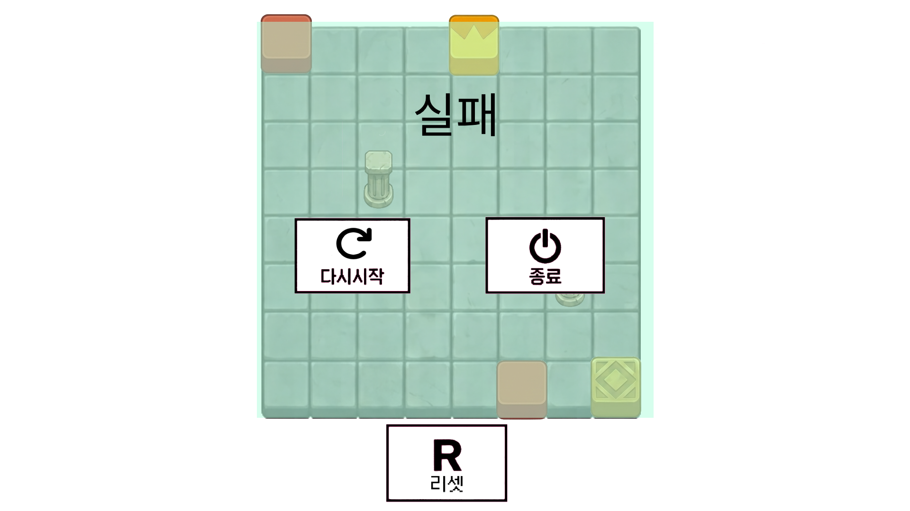
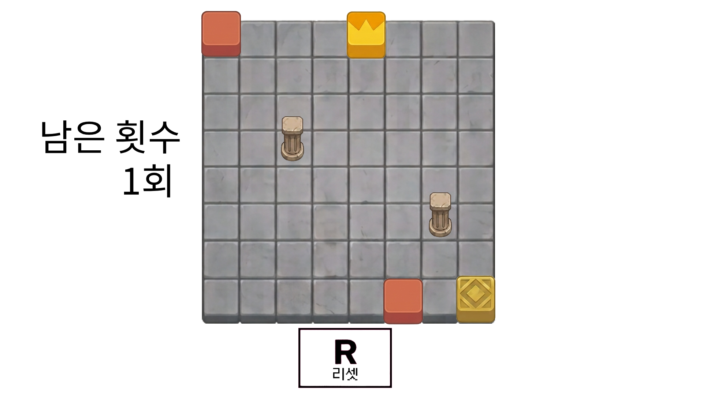
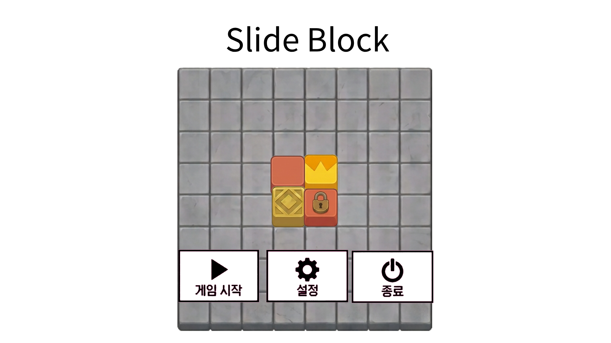

# Slide Block

## 게임 장르
 - 격자 기반 퍼즐

## 게임 개요
 - 격자 판 안에 배치된 블럭들을 밀어서 특정 위치에 배치시키는 게임

## 특징
 - 캐릭터 없음
 - 8x8 격자 판
 - 스테이지 별 맵 구성이 다름

## 조작
 - 마우스 좌클릭으로 메뉴 선택
 - 방향키 or wasd로 블럭을 밀 방향 선택
 - r키로 맵 초기화

## 오브젝트
 - 일반 블럭 : 아무 효과 없는 기본 오브젝트
 - 왕관 블럭 : 목표 블럭에 배치시켜야 하는 오브젝트
 - 목표 블럭 : 왕관 블럭을 배치시켜야 하는 오브젝트
 - 반전 블럭 : 입력과 반대 방향으로 움직이는 오브젝트
 - 잠금 블럭 : 처음에는 움직이지 않다가 조건을 만족해야 움직이는 오브젝트
 - 기둥 : 움직이지 않고 고정되어있는 오브젝트
 - 벽 : 기둥처럼 움직이지 않고 고정되어 있지만 특정 방향의 움직임만을 막는 오브젝트
 - 포탈 : 블럭이 포탈로 들어갈 시 다른 포탈로 나오는 오브젝트

## 블럭 이동 규칙
 - 방향 입력시 각 블럭이 정해진 방향으로 이동
 - 블럭은 기둥, 벽 또는 다른 블럭에 의해 이동이 불가능해질때까지 이동
 - 일반 블럭은 입력 방향으로, 반전 블럭은 입력 반대 방향으로 이동
 - 이동 방향이 다른 블럭이 이동 줄 충돌할 경우, 이동하려는 블럭의 수가 더 많은 방향으로 이동
 - 이동하려는 블럭의 수가 같을 경우 서로 이동하지 않고 정지
 - 포탈로 나온 블럭은 나온 방향으로 끝까지 이동

## 승리 조건
 - 주어진 횟수 안에 왕관 블럭을 목표 위치에 배치

## 패배 조건
 - 주어진 횟수 소진 & 왕관 블럭을 목표 위치에 배치 실패

## 게임 진행 방식
 - 스테이지 선택 → 게임 시작 → 방향 입력 → 블럭 이동 → 목표 달성 확인 → 스테이지 클리어 → 다음 스테이지
 
## 게임 예시 이미지

